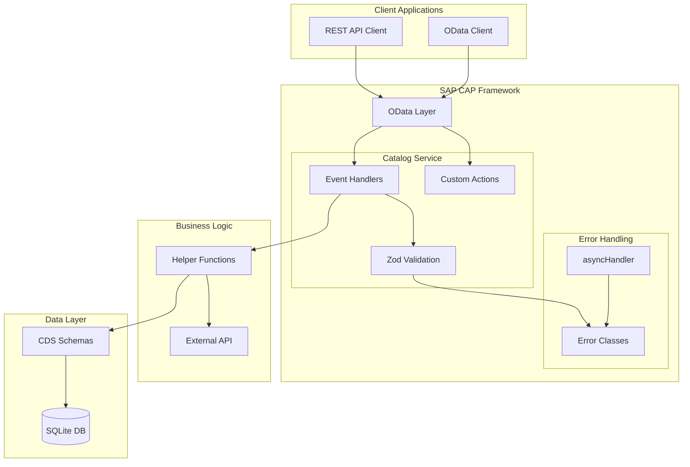

# SAP CAP Supplier Product Management API

A Cloud Application Programming (CAP) based REST API for managing suppliers, products, and product reviews with comprehensive validation and error handling.

## Overview

This project implements a comprehensive CRUD API for a supplier product catalog system with:

- **Suppliers Management**: Create, read, update, and delete suppliers
- **Products Management**: Full CRUD with external API integration for ratings
- **Product Reviews**: Rating system with automatic average calculation
- **Custom Actions**: Submit review action that updates product ratings
- **Input Validations**: Zod-based validation for all inputs
- **Error Handling**: Custom error classes with proper HTTP status codes

## Architecture Diagram



## Project Structure

```
cap-task/
├── db/
│   └── schema.cds              # Database schema definitions
├── srv/
│   ├── CatalogService.cds      # Service definitions
│   ├── CatalogService.ts       # Main service handlers (TypeScript)
│   └── CatalogService.helpers.ts # Helper functions
├── lib/
│   ├── errors/                # Custom error classes
│   │   ├── index.ts
│   │   ├── AppError.ts
│   │   ├── ValidationError.ts
│   │   ├── NotFoundError.ts
│   │   └── ApiError.ts
│   ├── utils/                 # Utility functions
│   │   └── asyncHandler.ts    # Centralized error handling wrapper
│   └── validation/            # Validation schemas
│       ├── index.ts
│       └── schemas.ts         # Zod validation schemas
├── types/
│   ├── entities.d.ts           # Entity type definitions
│   ├── service.d.ts           # Service-related types
│   ├── validation.d.ts        # Validation function types
│   └── external.d.ts           # External API types
├── tests/
│   ├── catalog-service.test.ts # Handler unit tests
│   ├── validations.test.ts     # Validation tests
│   └── errors.test.ts          # Error handling tests
├── tsconfig.json               # TypeScript configuration
├── tsconfig.build.json         # TypeScript build configuration
├── jest.config.ts              # Jest configuration
├── package.json                # Dependencies and scripts
└── README.md                   # This file
```

## Technology Stack

- **Framework**: SAP Cloud Application Programming (CAP) v8
- **Language**: TypeScript
- **Validation**: Zod v4
- **Database**: SQLite (development)
- **Testing**: Jest with ts-jest
- **HTTP Server**: Express (via CAP)

## Prerequisites

- Node.js (v18 or higher recommended)
- npm (comes with Node.js)

## Installation and Local Setup

### 1. Install Dependencies

```bash
npm install
```

This will install:
- `@sap/cds` - SAP CAP framework
- `@sap/cds-sqlite` - SQLite database adapter
- `sqlite3` - SQLite driver
- `express` - HTTP server
- `zod` - Schema validation
- `typescript` - TypeScript compiler
- `@types/node` - Node.js type definitions
- `@types/express` - Express type definitions
- `jest` - Testing framework
- `@types/jest` - Jest type definitions

### 2. Environment Variables (Optional)

Create a `.env` file in the project root to configure the external API:

```bash
# Optional: API key for external rating service
FAKE_STORE_API_KEY=your_scraperapi_key_here
```

If not provided, the system will skip external rating fetching gracefully.

### 3. Initialize the Database

```bash
npx cds deploy
```

This creates a SQLite database file (`db.sqlite`) with the schema.

### 4. Run the Project

#### Development Mode (Auto-reload)

```bash
npm run watch
```

This starts the CAP server with auto-reload on file changes.

#### Production Mode

```bash
npm run build
npm start
```

The server runs at `http://localhost:4004`.

#### Running Tests

```bash
npm test
```

## NPM Scripts

| Script | Description |
|--------|-------------|
| `npm run build` | Compile TypeScript to JavaScript in `dist/` directory |
| `npm run watch` | Start CAP server with auto-reload on file changes |
| `npm start` | Start the CAP server at `http://localhost:4004` |
| `npm test` | Run all Jest unit tests |
| `npm run clean` | Remove compiled JavaScript from `dist/` directory |
| `npm run deploy` | Initialize/reset the SQLite database |

## Validation (Zod Schemas)

This project uses [Zod](https://github.com/colinhacks/zod) for runtime validation. All validation schemas are defined in [`lib/validation/schemas.ts`](lib/validation/schemas.ts).

### Schema Types

| Schema | Description |
|--------|-------------|
| `SupplierSchema` | Base supplier validation |
| `ProductSchema` | Base product validation |
| `ProductReviewSchema` | Base review validation |
| `CreateSupplierSchema` | Supplier creation (excludes ID) |
| `CreateProductSchema` | Product creation (excludes auto-generated fields) |
| `CreateProductReviewSchema` | Review creation (excludes ID) |
| `UpdateSupplierSchema` | Partial supplier update |
| `UpdateProductSchema` | Partial product update |
| `UpdateProductReviewSchema` | Partial review update |
| `SubmitReviewSchema` | Custom action input validation |

### TypeScript Type Inference

Zod schemas automatically infer TypeScript types:

```typescript
import { 
  Supplier, 
  Product, 
  ProductReview,
  CreateSupplierInput,
  CreateProductInput
} from "../lib/validation/schemas";

// Types are automatically inferred from schemas
const supplier: Supplier = { ... };
const productInput: CreateProductInput = { ... };
```

## Error Handling

The project implements a custom error handling architecture with proper HTTP status codes.

### Error Classes

| Class | HTTP Status | Description |
|-------|-------------|-------------|
| `AppError` | - | Base error class with statusCode |
| `ValidationError` | 400 | Bad request, validation failed |
| `NotFoundError` | 404 | Resource not found |
| `ApiError` | 500 | External API errors |

All error classes are defined in [`lib/errors/`](lib/errors/).

### Async Handler

The [`lib/utils/asyncHandler.ts`](lib/utils/asyncHandler.ts) provides centralized error handling for all service handlers:

```typescript
import asyncHandler from "../lib/utils/asyncHandler";

service.before("CREATE", "Products", asyncHandler(async (req) => {
    // Handler logic
    // Errors are automatically caught and handled
}));
```

Features:
- Catches both sync and async errors
- Logs errors using `cds.log`
- Uses `req.reject()` with appropriate status codes
- Properly propagates custom error types

### Error Response Format

```json
{
  "error": {
    "code": "400",
    "message": "Price must be greater than 0"
  }
}
```

## API Endpoints

### Base URL

```
http://localhost:4004/catalog
```

### Suppliers

| Method | Endpoint | Description |
|--------|----------|-------------|
| GET | `/Suppliers` | List all suppliers |
| GET | `/Suppliers(UUID)` | Get supplier by ID |
| POST | `/Suppliers` | Create new supplier |
| PATCH | `/Suppliers(UUID)` | Update supplier |
| DELETE | `/Suppliers(UUID)` | Delete supplier |

**Sample Request - Create Supplier:**

```bash
curl -X POST http://localhost:4004/catalog/Suppliers \
  -H "Content-Type: application/json" \
  -d '{
    "name": "Tech Supplies Inc",
    "email": "contact@techsupplies.com",
    "rating": 4
  }'
```

**Sample Response:**

```json
{
  "@odata.context": "$metadata#Suppliers/$entity",
  "ID": "550e8400-e29b-41d4-a716-446655440000",
  "name": "Tech Supplies Inc",
  "email": "contact@techsupplies.com",
  "rating": 4
}
```

### Products

| Method | Endpoint | Description |
|--------|----------|-------------|
| GET | `/Products` | List all products |
| GET | `/Products(UUID)` | Get product by ID |
| POST | `/Products` | Create new product |
| PATCH | `/Products(UUID)` | Update product |
| DELETE | `/Products(UUID)` | Delete product |

**Sample Request - Create Product:**

```bash
curl -X POST http://localhost:4004/catalog/Products \
  -H "Content-Type: application/json" \
  -d '{
    "name": "Wireless Mouse",
    "price": 29.99,
    "category": "electronics",
    "supplier_ID": "550e8400-e29b-41d4-a716-446655440000"
  }'
```

**Sample Response:**

```json
{
  "@odata.context": "$metadata#Products/$entity",
  "ID": "660e8400-e29b-41d4-a716-446655440001",
  "name": "Wireless Mouse",
  "price": 29.99,
  "category": "electronics",
  "externalRating": 4.5,
  "averageRating": 0,
  "supplier_ID": "550e8400-e29b-41d4-a716-446655440000"
}
```

**Note:** When creating a product with a category, the system automatically fetches an external rating from FakeStoreAPI (via scraperapi) based on the category.

### Product Reviews

| Method | Endpoint | Description |
|--------|----------|-------------|
| GET | `/ProductReviews` | List all reviews |
| GET | `/ProductReviews(UUID)` | Get review by ID |
| POST | `/ProductReviews` | Create new review |
| PATCH | `/ProductReviews(UUID)` | Update review |
| DELETE | `/ProductReviews(UUID)` | Delete review |

**Sample Request - Create Review:**

```bash
curl -X POST http://localhost:4004/catalog/ProductReviews \
  -H "Content-Type: application/json" \
  -d '{
    "product_ID": "660e8400-e29b-41d4-a716-446655440001",
    "rating": 4,
    "comment": "Great product!",
    "reviewer": "John Doe"
  }'
```

### Submit Review Action

Submit a review and automatically update the product's average rating.

**Endpoint:** `POST /catalog/submitReview`

**Request:**

```bash
curl -X POST http://localhost:4004/catalog/submitReview \
  -H "Content-Type: application/json" \
  -d '{
    "productID": "660e8400-e29b-41d4-a716-446655440001",
    "rating": 5,
    "comment": "Excellent product, highly recommend!",
    "reviewer": "Jane Smith"
  }'
```

**Response:**

```json
{
  "success": true,
  "averageRating": 4.5
}
```

## Design Decisions and Trade-offs

### 1. SQLite vs HANA

**Decision:** Used SQLite for development and testing.

**Trade-off:** SQLite is file-based and suitable for development. For production with multiple concurrent users, SAP HANA or another enterprise database would be preferred.

### 2. Zod for Validation

**Decision:** Used Zod v4 for runtime schema validation instead of CAP's built-in validation annotations.

**Trade-off:**
- **Pros:** TypeScript integration, schema composition, detailed error messages, reusable across the application
- **Cons:** Additional dependency, validation logic separate from CDS model definitions

### 3. Custom Error Classes

**Decision:** Created a custom error hierarchy (AppError → ValidationError, NotFoundError, ApiError).

**Trade-off:**
- **Pros:** Consistent error handling, proper HTTP status codes, detailed error information, centralized via asyncHandler
- **Cons:** Additional code to maintain

### 4. External API Integration

**Decision:** Integrated with FakeStoreAPI via scraperapi.com proxy to fetch external ratings based on product category.

**Trade-off:**
- **Benefits:** Provides realistic rating data without manual entry, bypasses CORS issues
- **Risk:** External API dependency - if API is down, product creation continues without external rating (fail-safe approach)
- **Requirement:** Optional API key for scraperapi

### 5. UUID for IDs

**Decision:** All entity IDs use UUID type.

**Trade-off:**
- **Pros:** Globally unique, no collision concerns, better for distributed systems
- **Cons:** Less readable than simple integers, slightly larger storage

### 6. Average Rating Calculation

**Decision:** Calculated dynamically when a new review is submitted via the `submitReview` action.

**Trade-off:**
- **Pros:** Always up-to-date, no need for scheduled jobs
- **Cons:** Slight overhead on review creation (calculated on-the-fly)

### 7. Custom Action for Reviews

**Decision:** Created a custom `submitReview` action instead of just using standard POST to ProductReviews.

**Rationale:** The action encapsulates both review creation AND average rating update in a single atomic operation, ensuring data consistency.

## Assumptions Made

1. **Database Initialization**: Database is initialized on first `cds deploy` or automatically on server start.

2. **ID Generation**: UUIDs are used for all entity IDs. The server generates UUIDs for new entities automatically.

3. **Authentication**: Not implemented. In production, SAP CAP's built-in authentication and authorization should be configured.

4. **External API**: FakeStoreAPI is used as a mock external rating service via scraperapi. In production, this would be replaced with actual supplier rating APIs.

5. **CORS**: Default CAP CORS settings are assumed. For production, explicit CORS configuration may be needed.

6. **Numeric Precision**: Using Decimal(10,2) for prices and Decimal(3,2) for ratings is sufficient for the use case.

7. **Validation Library**: Zod v4 is used for validation, providing type-safe runtime validation separate from CDS model constraints.

## Validation Rules

The following validations are enforced via Zod schemas:

| Field | Entity | Validation Rule |
|-------|--------|-----------------|
| Price | Products | Must be > 0 |
| Category | Products | Max 50 characters |
| External Rating | Products | Must be 0-5 (if provided) |
| Average Rating | Products | Must be 0-5 (if provided) |
| Rating | Suppliers | Must be 1-5 |
| Rating | ProductReviews | Must be 1-5 |
| Comment | ProductReviews | Max 500 characters |
| Reviewer | ProductReviews | Max 100 characters |
| Name | Suppliers | Min 1, Max 100 characters |
| Email | Suppliers | Must be valid email format |

## Testing

### Unit Tests

The project includes comprehensive unit tests written in TypeScript:

- **Handler Tests** (`tests/catalog-service.test.ts`):
  - External API integration
  - Product creation with category
  - Review submission validation
  - Array handling

- **Validation Tests** (`tests/validations.test.ts`):
  - Zod schema validation
  - Price validation
  - Rating validation
  - Email validation
  - Field length validation
  - Edge cases

- **Error Tests** (`tests/errors.test.ts`):
  - Error class hierarchy
  - HTTP status codes
  - Error message formatting

### Running Tests

```bash
# Run all tests
npm test

# Run with coverage
npm test -- --coverage
```

## Environment Variables

| Variable | Required | Description | Default |
|----------|----------|-------------|---------|
| `FAKE_STORE_API_KEY` | No | API key for scraperapi.com to fetch external ratings | Uses fallback value |

When `FAKE_STORE_API_KEY` is not set, the system will log a warning and skip external rating fetching, allowing product creation to continue without interruption.

## Error Handling Details

All errors return appropriate HTTP status codes:

- `400` - Bad Request (validation errors from Zod or business logic)
- `404` - Not Found (entity doesn't exist)
- `500` - Internal Server Error

Error responses include a message describing the issue:

```json
{
  "error": {
    "code": "400",
    "message": "Price must be greater than 0"
  }
}
```

### Custom Error Examples

```typescript
// Validation error
throw new ValidationError("Price must be greater than 0"); // 400

// Not found error
throw new NotFoundError("Product with ID xyz does not exist"); // 404

// API error
throw new ApiError("Failed to fetch external rating"); // 500
```

## Future Improvements

1. **Authentication/Authorization**: Add user authentication and role-based access control
2. **Pagination**: Implement OData pagination for large datasets
3. **Caching**: Add caching for external API responses
4. **Logging**: Enhance logging with structured logging (e.g., Winston)
5. **API Documentation**: Add Swagger/OpenAPI documentation
6. **Database Migrations**: Implement proper database migration strategy for production
7. **Unit of Work**: Implement transaction handling for complex operations
8. **Rate Limiting**: Add rate limiting for external API calls
9. **Health Checks**: Add health check endpoint for monitoring
